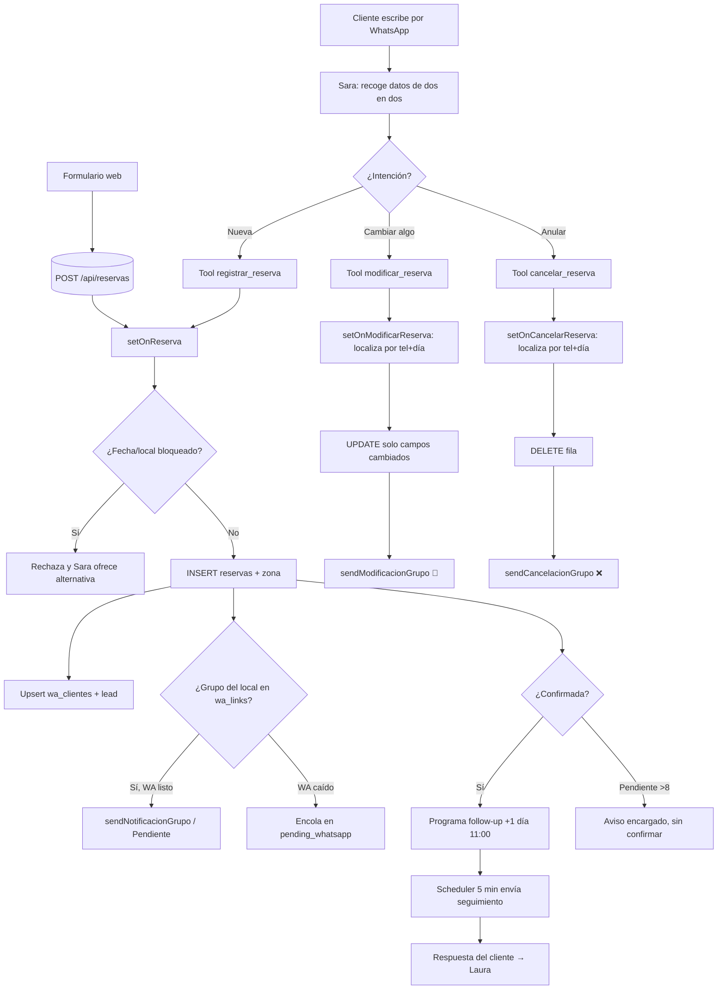

# Flujo de reservas (real, desde el código)

> Fuente: `whatsapp.js` (agente Sara + herramientas) y `server.js` (handlers `setOnReserva`, `setOnCancelarReserva`, `setOnModificarReserva`, ruta web `POST /api/reservas`). **No modificar sin pruebas verdes.**

## 1. Entradas
Una reserva puede nacer por dos vías:
- **WhatsApp (Sara):** el cliente escribe; el agente recoge los datos y llama a la herramienta `registrar_reserva`.
- **Web pública:** formulario → `POST /api/reservas` (mismo INSERT de 7+1 columnas).

## 2. Datos de una reserva
`local`, `dia`, `hora`, `personas`, `nombre_reserva`, `telefono`, `pendiente` (bool, >8 personas), `zona` (`terraza`/`interior`/`indiferente`; solo se pregunta en La Tapeta-Blanes, Cooperativa-Blanes y La Tapeta-Lloret).
Tabla `reservas`: `id, local, personas, dia, hora, telefono, nombre_reserva, creado_en, zona`.

## 3. Reglas de negocio (en el prompt/herramientas de Sara)
- Horario válido: mediodía 12:30–15:30 o cena 19:30–22:30.
- **Bloqueos** (`bloqueos_reservas`, local o "Todos", rango de fechas): Sara nunca ofrece ni registra en esos rangos; el handler `setOnReserva` revalida con `estaBloqueado(local, dia)` y rechaza con motivo.
- **>8 personas** → `pendiente: true`: se registra pero NO confirmada; un encargado contacta. Notificación especial al grupo.
- **Zona**: solo en los 3 locales indicados; resto `indiferente`.

## 4. Persistencia y efectos (handler `setOnReserva`)
1. Revalida bloqueo → si bloqueado, devuelve `{ok:false, motivo}` (Sara lo explica).
2. `INSERT INTO reservas (...)` con `zona`.
3. Upsert de perfil del cliente en `wa_clientes` (nombre/teléfono).
4. `upsertLeadFromReserva` → registra/actualiza lead.
5. Busca el **grupo del local** en `wa_links` y notifica: `sendNotificacionGrupo` (o `sendNotificacionGrupoPendiente` si pendiente). Si WhatsApp no está listo, encola en `pending_whatsapp`.
6. Si confirmada, programa **follow-up** al día siguiente 11:00 en `followup_scheduled`.

## 5. Modificación (herramienta `modificar_reserva` → `setOnModificarReserva`)
- Localiza la reserva por **teléfono (últimos 9 dígitos) + día actual** (+ local si se sabe).
- `UPDATE` **solo de los campos cambiados** (personas/hora/día/zona); construye diff antes→después.
- Backup KV; notifica al grupo con `sendModificacionGrupo` ("🔄 Reserva modificada"). **No borra** la fila. (Distingue explícitamente modificación de cancelación.)

## 6. Cancelación (herramienta `cancelar_reserva` → `setOnCancelarReserva`)
- Localiza igual (teléfono + día [+ local]).
- `DELETE` físico de la fila; backup KV; notifica al grupo con `sendCancelacionGrupo` ("❌ Reserva cancelada").

## 7. Follow-up (scheduler cada 5 min)
- Envía el mensaje de seguimiento cuando `send_at <= ahora`; marca `markAwaitingFollowup`. La respuesta del cliente se reenvía a Laura.

## 8. Errores, reintentos, duplicados
- Errores del handler → Sara informa de "problema técnico" y ofrece llamar al local (no inventa confirmación).
- Notificación a grupo con WhatsApp caído → cola `pending_whatsapp` (se reintenta al reconectar).
- Deduplicación de mensajes entrantes por debounce/batch (ver `FLUJO_WHATSAPP.md`); no hay dedupe explícito de reservas (posible mejora futura, fuera de fase).

## 9. Diagrama

## 10. Puntos sensibles para el aislamiento por local (futuro)
- `GET /api/reservas` y `export.csv` deberán filtrar por los locales del usuario.
- La notificación ya va al grupo correcto por `wa_links` (no cambiar ese mecanismo).
- El acceso de lectura/gestión de reservas será `reservas.ver` / `reservas.editar` / `reservas.cancelar` acotado por local (ver `MODELO_MODULOS_Y_PERMISOS.md`).
