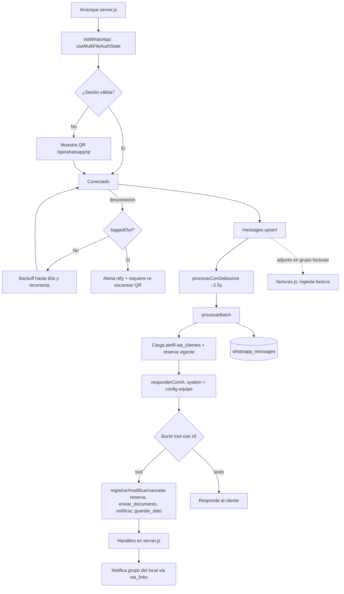

# Flujo de WhatsApp / Sara (real, desde el código)

> Fuente: `whatsapp.js` (Baileys + Anthropic Claude) y sus callbacks en `server.js`. **Zona crítica en producción — no modificar librería, sesión, listeners, reconexión, formato de teléfonos/JIDs ni herramientas en esta fase.**

## 1. Inicialización y sesión
- Librería **Baileys** (`@whiskeysockets/baileys`) con `useMultiFileAuthState`.
- Credenciales en `AUTH_DIR`: `/home/runner/latapeta-data/baileys_auth` en Replit o `./baileys_auth` en local (`resolveAuthDir`).
- Logger de Baileys silenciado con `pino({level:"silent"})`.
- El directorio de auth está en `.gitignore` y **no se incluye en el backup KV** → por eso **cada redeploy pierde la sesión** y hay que re-escanear el QR.

## 2. QR y estado
- `GET /api/whatsapp/qr` expone el QR; `GET /api/whatsapp/status` el estado de conexión.
- El panel de Encargados/Dirección/Marketing muestra el QR para vincular.

## 3. Reconexión y alertas
- Reconexión con **backoff exponencial** hasta ~60 s. En `loggedOut` **no** reconecta (requiere re-escanear QR).
- **Alerta ntfy** al topic `familia-del-amor-wa-7k9m2p` cuando WhatsApp se cae.

## 4. Recepción de mensajes
- Listener `messages.upsert` → `procesarConDebounce` (agrupa mensajes seguidos ~2.5 s) → `procesarBatch` → `responderConIA`.
- **Cola por cliente** para no corromper el historial en el bucle agéntico.
- **Deduplicación** de mensajes de sistema (limpieza a 15 s).
- Identifica al cliente por su JID/teléfono; carga su **perfil** (`wa_clientes`, notas JSON) y su **reserva vigente** (`setReservaLoader`) como contexto.

## 5. Motor IA (Sara)
- `responderConIA`: arma system prompt fijo (cacheado) + bloque de **configuración del equipo** (instrucciones, bloqueos, documentos, respuestas) inyectado por `setSaraConfigLoader`.
- Modelo `claude-haiku-4-5`; **bucle agéntico** de hasta 5 iteraciones de tool-use.
- Herramientas: `registrar_reserva`, `modificar_reserva`, `cancelar_reserva`, `enviar_documento`, `notificar_nerea`, `notificar_silvia`, `guardar_dato_cliente`.

## 6. Envío
- Texto, **documentos** (PDF/cartas vía `documentoResolver`) e **imágenes**.
- Mensajes a **grupos** de local (`wa_links`) para notificar reservas.
- Envío manual desde panel: `POST /api/whatsapp/send` (solo dirección). Campañas: `/api/campanas/*` con delay ~4 s entre envíos.
- Historial persistido en `whatsapp_messages` (tipo intercambio/manual/histórico); rehidratación de memoria desde BD tras reinicio; sesión de conversación nueva tras ~4 h de inactividad (el perfil persiste).

## 7. Relación con otros módulos
- **Reservas:** las herramientas de Sara disparan los handlers de reservas (ver `FLUJO_RESERVAS.md`).
- **Facturas IA:** adjuntos (PDF/imagen) en grupos marcados como "grupo de facturas" se procesan por el motor de `facturas.js` (ingesta por WhatsApp), en paralelo a la ingesta por Gmail.
- **Follow-ups:** scheduler que envía seguimientos y reenvía respuestas a Laura.

## 8. Diagrama

## 9. Restricciones para esta fase
- No cambiar: librería, `useMultiFileAuthState`, formato de JIDs/teléfonos/grupos, listeners, reconexión, herramientas ni instrucciones de Sara.
- Cualquier cobertura de pruebas se hace con **socket mockeado** (nunca contra la sesión real).
- Permisos futuros del módulo: `whatsapp.ver`, `whatsapp.responder`, `whatsapp.gestionarGrupos`, `whatsapp.gestionarConexion` (ver `MODELO_MODULOS_Y_PERMISOS.md`).
